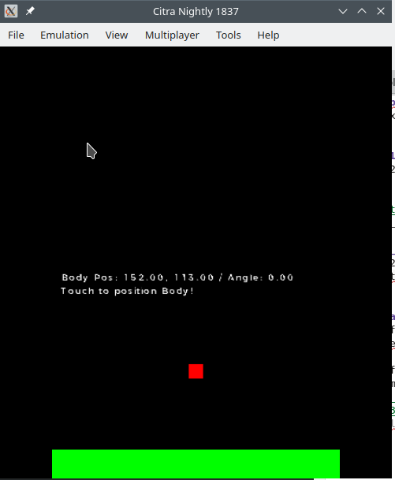
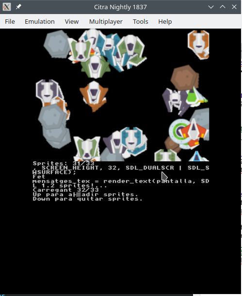
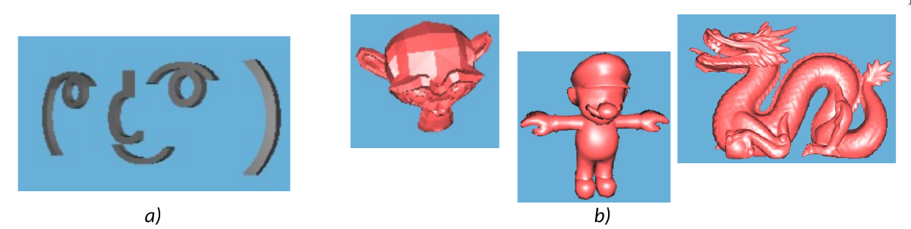
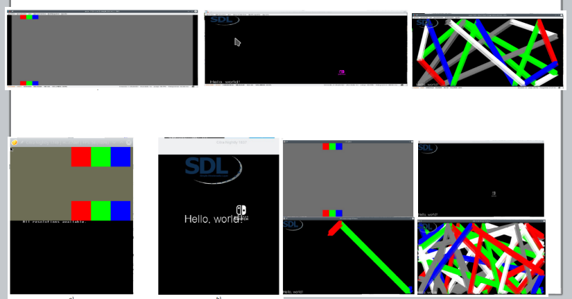
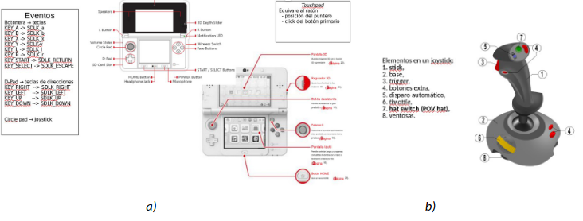
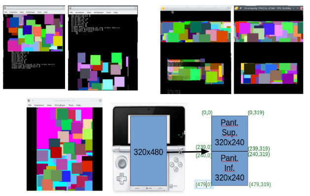
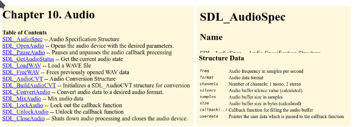
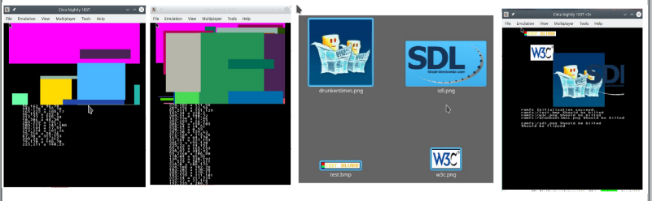

<!--
Sintaxis README
https://docs.github.com/es/get-started/writing-on-github/getting-started-with-writing-and-formatting-on-github/basic-writing-and-formatting-syntax#hiding-content-with-comments

Tokens
https://docs.github.com/es/authentication/keeping-your-account-and-data-secure/managing-your-personal-access-tokens

-->
# 3DS-homebrew-development
Homebrew examples for 3DS from "videoconsole development" subject using [devkitPro](https://devkitpro.org/). 
Thanks to the creators and maintainers of [devkitPro](https://devkitpro.org/), and specially to  Drunken Coders, mtheall, sgstair, WinterMute, Patater, AntonioND, fincs ( ͡° ͜ʖ ͡°) and PabloMK7.
Also thanks to the creators and maintainers of 3DS emulators such as Citra (RIP), Citra MK7's fork, Lime, Panda3DS, Mikage, Mandarine3DS.And to the creators and maintainers of documentation 3DBrew, GBATek, 

Contents of this repo:
- Using Box2D with SDL on [3DS__SDL1_2_box2D](https://github.com/magusti/3DS-homebrew-development#3ds__sdl1_2_box2d).
* Using sprites ib SDL 1.2 on [3DS__SDL1_2_box2D](https://github.com/magusti/3DS-homebrew-development#3ds_sdl1_2_sprites).
* Loading 3D mesh OBJ files statically on [3DS_cargarMalla3D_estatica](https://github.com/magusti/3DS-homebrew-development#3ds_cargarmalla3d_estatica).
* Basic SDL examples from Switch examples [3DS_sdl-simple & 3DS_sdl-demo](https://github.com/magusti/3DS-homebrew-development#ejemplos-b%C3%A1sicos-de-portabilidad-de-aplicaciones-basadas-en-sdl-comparativa-entre-plataforma-switch-escritorio-y-3ds).
* How to configure Video Mode in SDL for 3DS [3DS_sdl-videoMode](https://github.com/magusti/3DS-homebrew-development/tree/main#3ds_sdl-videomode).
* How to use audio in SDL for 3DS [3DS_sdl-audio](https://github.com/magusti/3DS-homebrew-development/tree/main#3ds_sdl-audio).
+ How to use bitmap images in SDL for 3DS [3DS_sdl-image](https://github.com/magusti/3DS-homebrew-development/tree/main#3ds_sdl-image).

## 3DS__SDL1_2_box2D
The SDL 1.2 version of *box2D* example from **3ds-examples**.

Screenshot of 3DS example *physics/box2d* using SDL 1.2.

## 3DS_SDL1_2_sprites
The SDL 1.2 version of *gpusprites* example from **3ds-examples**.

Screenshot of 3DS example *graphics/gpu/gpusprites* rewriting the graphic interface using SDL 1.2.

[Related to Switch example](https://github.com/magusti/Switch-homebrew-development?tab=readme-ov-file#switch__sdl2_0_sprites).

## 3DS_cargarMalla3D_estatica
A review of *lenny* example, from **3ds-examples**, that loads an OBJ mesh choosen at compile time.

Examples of outputs from the lenny example rewrite as a 3D mesh visualizer (a) original and (b) three models converted from OBJ format to C code with "convertOBJ_toC.c".
.

Comented in [M. Agustí. (2024). Importar mallas 3D en tiempo de compilación para una aplicación de videojuego en la 3DS. Universitat Politècnica de València](http://hdl.handle.net/10251/205403).

## 3DS_sdl-simple and 3DS_sdl-demo
A review of Switch examples **sdl2/sdl2-simple** (*3DS_sdl-simple*) and **sdl2/sdl2-demo** (*3DS_sdl-demo*) ported to 3DS (SDL 1.2) and, also, to Linux (PC, SDL 2.0) to compare the way of develelop with SDL in the three platforms.

Screenshot of Switch example *sdl2/sdl2-simple* and *sdl2/sdl2-demo* (upper row), 3DS (lower row, left)  and PC (lower row, right) version.

Comented in [M. Agustí. (2024). Ejemplos básicos de portabilidad de aplicaciones basadas en SDL: comparativa entre plataforma Switch, escritorio y 3DS. Universitat Politècnica de València](http://hdl.handle.net/10251/204900).

## 3DS_sdl-videoMode
Input events for SDL 1.2 in 3DS: (a) 3DS keys & (b) Joystick-like.

Examples of outputs from different graphic modes on 400x240: graphics & text (upper row, left), only graphics (upper row, right) and dual mode (lower row).

Comented in [M. Agustí. (2024). Introducción al desarrollo con SDL 1.2 para plataforma 3DS. Modos de vídeo y eventos. Universitat Politècnica de València](http://hdl.handle.net/10251/205439).

## 3DS_sdl-audio
Using audio in SDL 1.2 on 3DS: basic operations.

Audio support in SDL 1.2 core on 3DS: (a) operation & (b) data structures.

Commented in [M. Agustí (2024). Introducción al desarrollo con SDL 1.2 para plataforma 3DS. uso del audio. Universitat Politècnica de València](http://hdl.handle.net/10251/205231).

## 3DS_sdl-image
Using images in SDL 1.2 on 3DS: basic operations.

Image basic operations suppot in SDL 1.2 core on 3DS: rectangles and BMP files.

Commented in [M. Agustí (2024). Introducción al desarrollo con SDL 1.2 para plataforma 3DS. Uso de imágenes. Universitat Politècnica de València](http://hdl.handle.net/10251/205415).

